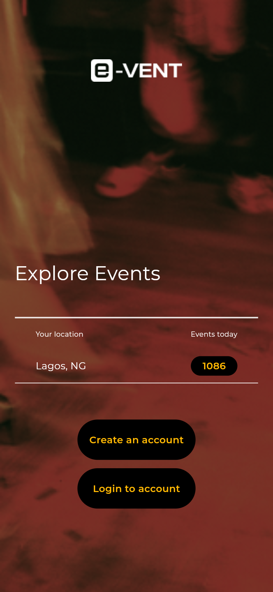
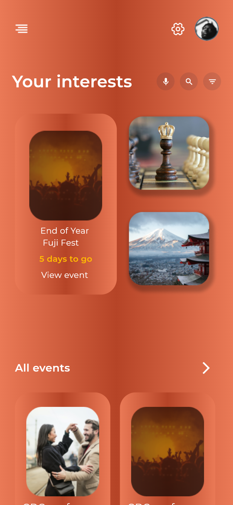
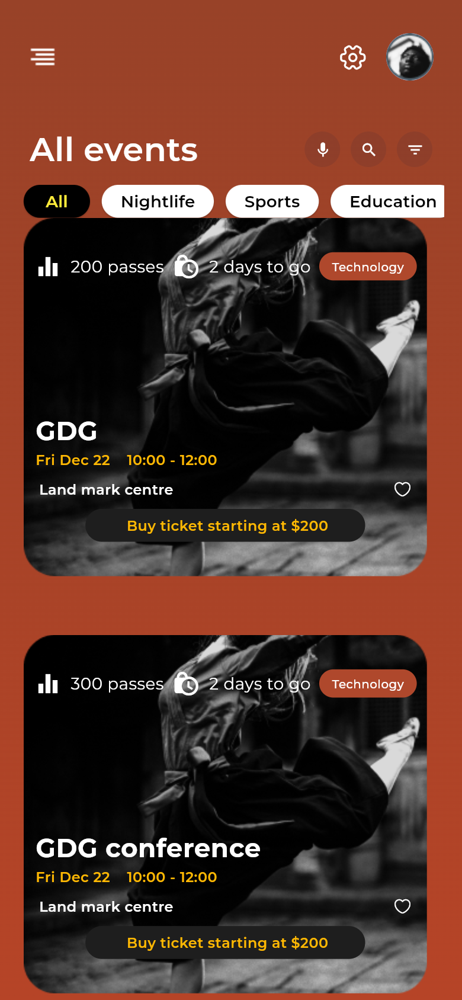
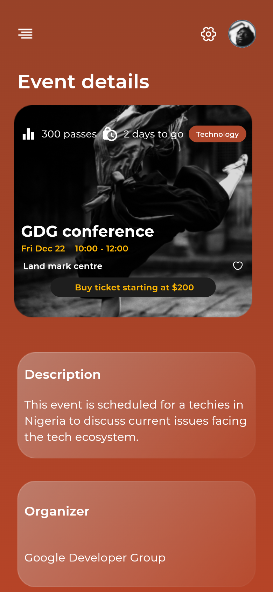
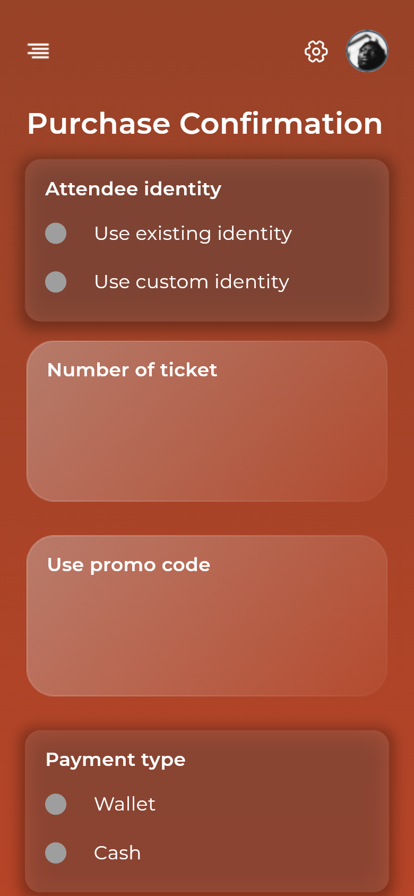
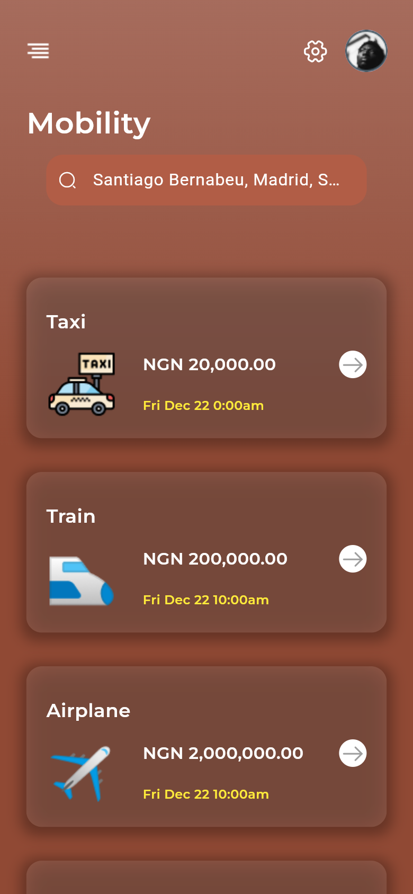

# E-VENT: Event Discovery & Ticketing App

A Flutter mobile app for discovering events, buying tickets, and planning the trip around them (transport and accommodation), all in one place.


-orange)


> **Status:** front-end UI prototype. Screens, navigation and view-model state are implemented; event data is static sample data (no backend yet).

## Screenshots

<table>
  <tr>
    <td align="center"><br/><sub>Landing</sub></td>
    <td align="center"><br/><sub>Home: your interests</sub></td>
    <td align="center"><br/><sub>All events + category filters</sub></td>
  </tr>
  <tr>
    <td align="center"><br/><sub>Event details</sub></td>
    <td align="center"><br/><sub>Purchase confirmation</sub></td>
    <td align="center"><br/><sub>Mobility options</sub></td>
  </tr>
</table>

## Features

- **Onboarding & auth screens**: landing page with location and "events today" summary, login and sign-up (Google / Facebook buttons in the UI).
- **Event discovery**: "Your interests" home feed, full event list with category chips (Nightlife, Sports, Education, …), search/filter controls and favourites.
- **Event details**: description, organiser, date/time, venue and ticket price.
- **Ticket purchase flow**: two-step buy-ticket flow with attendee identity selection, ticket quantity counter, promo code and payment type (wallet / cash), then a purchase confirmation.
- **My tickets**: tickets list with *All / Favourited / Purchased* tabs.
- **Mobility**: map view plus taxi, train and flight options with prices and departure times.
- **Beds (accommodation)**: map view, location search, booking details (description, utilities) and booking confirmation.
- **Vendors**: vendor list with *All / Favourited / Booked* tabs.
- Side drawer navigation and consistent glass-style gradient UI.

## Tech Stack & Architecture

| Area | Choice |
|---|---|
| UI | Flutter, Material, `google_fonts`, `ficonsax` icons |
| State management | **Stacked** (MVVM): one `ViewModel` per screen, shared `BaseModel` |
| Navigation | **auto_route** (typed, generated routes with custom slide transitions) |
| Dependency injection | **get_it** service locator (router registered as a lazy singleton) |
| Responsive sizing | `flutter_screenutil` (design size 393 × 851) |

## Project Structure

```
lib/
├── application/   # Stacked view models (home, all events, buy ticket, tickets, mobility…)
├── model/         # Event model + sample data
├── navigation/    # get_it locator setup
├── routes/        # auto_route config (app_router.dart) and generated routes
├── screens/       # UI screens (landing, login, home, event details, beds, mobility, vendors…)
├── utils/         # shared widgets and helpers (app bar, drawer, spacing)
└── main.dart
images/            # app artwork and icons
```

## Getting Started

```bash
git clone https://github.com/Mickool17/events.git
cd events
flutter pub get
flutter run            # or: flutter run -d chrome
```

If you change routes, regenerate them with:

```bash
dart run build_runner build --delete-conflicting-outputs
```

## Author

**Oladimeji Micheal Tomisin**, Full-Stack & AI Engineer
GitHub: [@Mickool17](https://github.com/Mickool17)
